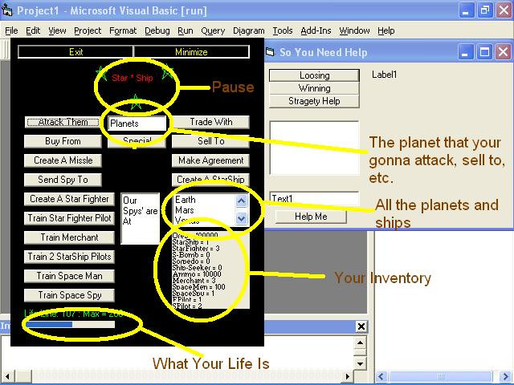



## StarShip Fighter v1\.0

### Description

On PSC I saw this stragety game so I wanted to make my own. I did make one and I also think that it is pretty good. There is kinda of a help file and you can read the Meanings.txt if you need further help. I could go on and on about my game, but I think it is better if you play it then just read about it. Please leave comments and votes. Have fun and thanks in Advance.
 
### More Info
 

             |
---                |---
**Submitted On**   |2002-06-18 18:19:54
**By**             |[Sehab](https://github.com/Planet-Source-Code/PSCIndex/blob/master/ByAuthor/sehab.md)
**Level**          |Intermediate
**User Rating**    |5.0 (15 globes from 3 users)
**Compatibility**  |VB 6\.0
**Category**       |[Games](https://github.com/Planet-Source-Code/PSCIndex/blob/master/ByCategory/games__1-38.md)
**World**          |[Visual Basic](https://github.com/Planet-Source-Code/PSCIndex/blob/master/ByWorld/visual-basic.md)
**Archive File**   |[StarShip\_F962706182002\.zip](https://github.com/Planet-Source-Code/sehab-starship-fighter-v1-0__1-36004/archive/master.zip)

